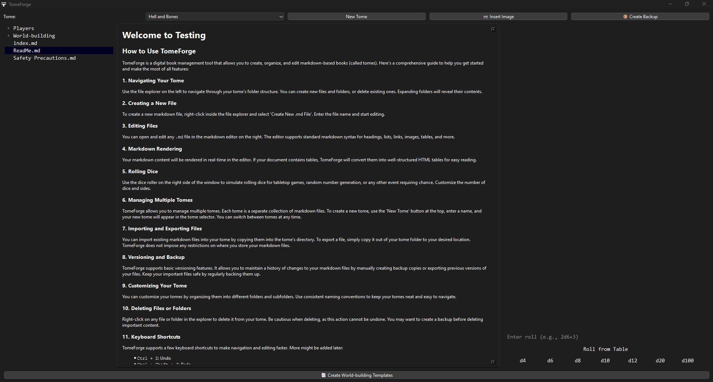

# TomeForge

**TomeForge** is an alternative to Obsidian, built specifically to enhance your TTRPG experience. With integrated markdown editing, dice rolling, and intelligent table interpretation, TomeForge lets you run a D&D session — or any narrative project — quickly and easily.


---

## ✨ Features

- 📂 **File Explorer** to navigate and manage markdown files inside a "Tome"
- 📝 **Markdown Editor** with live rendering and preview
- 🎲 **Dice Roller** for D&D-style randomization (supports standard dice types)
- 📚 **Multiple Tomes** management (project-level isolation)
- 📄 Auto-generates `index.md` and `ReadMe.md` for new tomes
- 📑 Intelligent parsing of markdown tables
- 🧠 Remembers your last open Tome across sessions
- 🖱️ **Double-click navigation**: Select or open files/folders by double-clicking in the explorer

---

## 🧰 How It Works

TomeForge creates a directory in your `Documents` folder named `TomeForge`. Each "Tome" is a subdirectory representing a project (e.g., a D&D campaign). Inside each tome, you can create and manage markdown files. The app allows right-click creation, deletion, and viewing of `.md` files.

When the app starts:
- It checks for the `TomeForge` folder in your documents.
- Loads the last active tome (if available).
- Presents a clean interface: **Explorer (left)** | **Editor (center)** | **Dice Roller (right)**

> ⚠️ **Tip**: To select or open a file or folder in the file explorer, you must **double-click** it.

---

## 📂 File Structure

```
Documents/
└── TomeForge/
│   ├── MyCampaign/
│     ├── index.md
│     ├── ReadMe.md
│     └── encounters/
│         └── goblin\_ambush.md
│   └── AnotherTome/
````

---

## 🛠️ Getting Started

1. **Clone or Download** the repository.
2. Launch `main.exe` (precompiled) — no Python installation required.
3. Create your first **Tome**, and start writing in `index.md` or any `.md` file.
4. Use the integrated Dice Roller or markdown table roll parser.

---

## 🧪 Dice & Table Rolls

You can roll dice like:

- `1d20 + 5`
- `2d6 + 3`

You can also define and roll from markdown tables:

```markdown
| Result | Description          |
|--------|----------------------|
| 1      | A sudden ambush      |
| 2      | Hidden treasure found|
| 3      | Mysterious fog rolls in |
````

TomeForge will interpret this for quick random events.

---

## 📦 Installer & Distribution

* Uses **PyInstaller** to create a self-contained `.exe`
* Distributed via **Inno Setup Installer** (includes optional program launch, Start Menu and desktop shortcuts)

---

## 🔒 License

This project is licensed under a **custom license**. You may:

* Use and run TomeForge for personal projects
* Reference or take inspiration from its functionality

But you may **not**:

* Modify, redistribute, or reuse the source code
* Create derivative software using this code without permission

See the [LICENSE](LICENSE) file for more details.

---

## 🙋‍♂️ Support

Having issues? Want to suggest a feature? Reach out via the [Issues](https://github.com/AmadeusSpeaks/TomeForge/issues) tab.

---

## 📸 Screenshots



---

Happy DMing 🧙‍♂️ and creating ✨ with **TomeForge**!

### Disclaimer Regarding Image Rendering

Please note that images displayed within this application may not appear exactly as they do in other photo viewers (e.g., Windows Photos) due to differences in rendering engines. If you experience visual glitches or artifacts with images (such as strange colors or corruption), this may be a result of how the images are handled in the application’s viewer.

To ensure the best image display:

* Ensure that images are in standard formats like PNG, JPG, or GIF.
* Some rare image formats or special image properties may cause visual discrepancies within the editor.

If you encounter such issues, it’s recommended to check the images in a standard photo viewer (such as Windows Photos) to verify that the files themselves are not corrupted.

We are actively working to improve the image rendering and appreciate your understanding.

